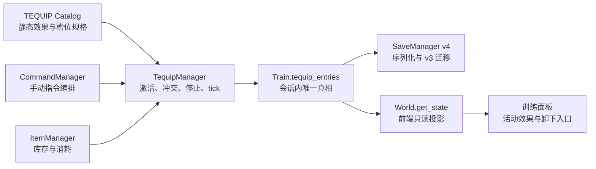

# 槽位 / TEQUIP 系统分析

> 状态：仅分析，不包含实现
>
> 分析基线：`feature/new-features` / `5ebd3c2a8535cfb45e8b0b24213747924bf8cf41`
>
> 目标：为持续性指令提供可靠的会话内承载结构，并为后续调教装备留出扩展路径。

## 1. 结论摘要

当前工程已经有两套容易被“槽位”一词混淆的概念：

1. `SaveManager` 的 1～3 号存档槽位，是持久化文件选择器。
2. 计划中的 `tequip` 槽位，是调教会话内某个角色身体部位或行动资源的占用关系。

两者不应共享类型、管理器或 API。建议代码和界面始终使用“存档槽位”和“TEQUIP 占用位”两个完整名称。

当前持续指令以 `Train.continuous_commands: list[str]` 保存指令 ID。这足以支持“爱抚”单指令开关，但无法表达：

- 谁在对谁持续执行；
- 指令占用了哪些身体部位或行动资源；
- 两个持续动作能否共存；
- 装备来自哪个道具、装在谁身上；
- 同一种装备或指令的多个实例；
- 冲突、卸下、失效和存档迁移规则。

建议下一步不要继续给 `continuous_commands` 增加并行列表，而是引入一个以 `Train` 为生命周期边界的 TEQUIP 运行时模型。持续指令和调教装备应是同一“占用系统”的两种有类型的条目，而不是都退化成字符串或自由 `dict`。

## 2. TEQUIP 的语义来源

Era / Emuera 体系中的 `TEQUIP` 是按角色保存的调教期临时装备/状态数组，可用于振动器、药物及其他强化状态；相关资料也将其描述为进入调教时初始化的调教装备变量：

- [Era Wiki：TEQUIP 变量说明](https://wiki.eragames.rip/index.php/Emuera/eramavar)
- [Era Wiki：BEGIN TRAIN 时初始化 TEQUIP](https://wiki.eragames.rip/index.php/Emuera/flow#TRAIN)
- [Era 开发教程：TEquip.csv 与调教期变量](https://lackbfun.pages.dev/era/era-diy-tutorial-12-csv/)

本项目 `next.md` 又明确希望用它承载持续性指令。因此，本项目的 TEQUIP 会比传统语义更宽：它不仅表示“穿戴了什么”，还表示“哪些调教效果正在持续并占用哪些槽位”。这是项目自己的扩展，不应假定与原版 Era 的数字数组一一对应。

仓库历史中没有出现过 `tequip` 实现或设计。`git log --all -S'tequip' -- .` 和 `git log --all -G'tequip' -- .` 在当前仓库均无结果。历史设计文档只覆盖了 `SaveManager` 的存档槽位，后者已由 `4727108`、`ad48a09`、`814342d` 等提交实现。

## 3. 当前架构事实

| 位置 | 当前职责 | 与 TEQUIP 的关系 |
|---|---|---|
| `game_engine/managers/TrainManager.py` | 创建/结束调教会话，维护参与者、阵营、主导权和持续指令列表 | 最合适的生命周期所有者 |
| `game_engine/managers/CommandManager.py` | 执行手动指令，并在之后重复执行持续指令 | 当前持续效果的编排入口 |
| `game_engine/commands/_commands.py` | 用多个注册表保存指令元数据，`continuous` 是布尔标记 | 只能表示“可持续”，没有槽位规格 |
| `game_engine/managers/SaveManager.py` | v3 存档，保存完整调教会话与 `continuous_commands` | 后续需要 v3→v4 迁移 |
| `world.py` | 组装前端状态，输出 `train_com` 与参与者 | 后续需要输出 TEQUIP 展示模型 |
| `game_engine/managers/ItemManager.py` | 管理库存数量；当前没有通用道具效果 | 未来装备来源，但不应拥有调教期穿戴状态 |
| `game_engine/managers/SkinManager.py` | 已拥有/穿戴皮肤的长期状态 | 可参考 API 形式，不能直接复用为 TEQUIP |
| `frontend/js/ui/commands.js` | 渲染指令；只消费 `name` 等字段 | 现有持续开关无需专用 UI |
| `frontend/js/ui/train_panel.js` | 渲染参与者与调教侧别 | 适合新增 TEQUIP 状态区 |

当前持续指令链路如下：

1. `caress` 通过 `continuous=True` 注册。
2. 首次执行时，`CommandManager.do_cmd()` 先执行一次，再把 `caress` 放入 `Train.continuous_commands`。
3. 执行其他调教指令后，`_run_continuous_commands()` 顺序重复所有活动指令。
4. 再次点击活动指令时，从列表移除，不推进时间。
5. `TrainManager.get_train_commands()` 根据列表生成 `active` 和“停止爱抚”名称。
6. v3 存档直接保存并恢复字符串列表。

这个链路已经形成可用的最小闭环，因此 TEQUIP 迁移必须保持这些外部行为，不能要求前端一次性重写。

## 4. 当前模型的主要限制

### 4.1 字符串列表没有占用关系

`['caress']` 只能说明某类指令活动，不能说明玩家的双手是否已被占用、Z23 的身体是否已经被其他效果占用，也不能解释冲突原因。

### 4.2 指令 ID 不能作为实例 ID

未来同一效果可能同时存在于不同目标，或同一装备存在多个实例。以 `command_key` 作为唯一标识会阻止这些情况，也无法让界面精确卸下某一个实例。

### 4.3 持续指令与被动装备的时间语义不同

当前持续“爱抚”会再次调用完整指令处理器，因此每次既产生效果又额外推进 5 分钟。装备类效果通常应在手动指令已经消耗的时间内结算，不应再次推进世界时间。

如果不先区分这两类 tick 语义，未来振动器等装备接入后会出现一次操作重复推进多段时间的问题。

### 4.4 失效处理缺少可观察原因

当前活动指令在 `can` 失败时会被静默移除。槽位系统需要区分：

- 用户主动停止；
- 因角色离场或阵营变化自动释放；
- 因槽位冲突而拒绝启动；
- 因存档内容损坏或定义丢失而无法恢复。

### 4.5 存档只验证外层结构

v3 会恢复任意字符串到 `continuous_commands`。执行时虽可删除未知指令，但这会把数据错误变成静默状态丢失。TEQUIP 存档应在读档边界验证条目种类、效果 ID、参与者和槽位。

## 5. 推荐的职责边界



建议职责如下：

- `Train`：拥有本场调教的 TEQUIP 条目；`new_train()` 创建空集合，`end_train()` 整体释放。
- `TequipManager`：负责激活、原子冲突检查、停止、失效清理和 tick，不负责库存展示。
- `CommandManager`：仍是用户指令入口，但把持续状态管理委托给 `TequipManager`。
- `ItemManager`：只证明道具是否拥有并执行库存扣减；成功激活后由 TEQUIP 承载运行时状态。
- `SaveManager`：保存 TEQUIP 条目，不保存可从条目推导的槽位索引。
- `World.get_state()`：输出只读展示模型，前端不能直接修改原始条目。

不建议把所有逻辑继续塞进 `TrainManager`。它已经负责会话、参与者和阵营；再加入库存事务、冲突解析和 tick 会让职责混合。

## 6. 推荐数据模型

以下仅是接口草案，不是待直接复制的实现代码。

```python
@dataclass(frozen=True, slots=True)
class SlotRef:
    character_id: str
    slot_key: str


@dataclass(frozen=True, slots=True)
class ContinuousTequip:
    entry_id: str
    command_key: str
    actor_ids: tuple[str, ...]
    target_ids: tuple[str, ...]
    reservations: tuple[SlotRef, ...]


@dataclass(frozen=True, slots=True)
class EquipmentTequip:
    entry_id: str
    item_id: str
    wearer_id: str
    reservations: tuple[SlotRef, ...]
```

运行时建议使用：

```text
Train.tequip_entries: list[ContinuousTequip | EquipmentTequip]
```

不建议同时持久化 `entries` 和 `slot_index`，否则会产生“条目说已占用，但索引说空闲”的双重真相。当前规模很小，每次从条目集合计算已占用槽位足够快；只有经过性能测量后才需要派生缓存。

### 6.1 为什么使用判别联合，而不是一个 payload 字典

持续指令和装备的必填字段不同：

- 持续指令需要 `command_key`、调教者和目标；
- 装备需要 `item_id` 和穿戴者；
- 两者都需要唯一实例 ID 和槽位预约。

使用两个明确类型可以避免大量运行时 `if 'item_id' in payload` 判断，也便于存档边界做穷尽解析。

### 6.2 建议的第一批槽位

第一批只定义当前和近期功能真正需要的槽位，不预建 100 个 Era 数字位：

| 槽位 | 所属角色 | 可能用途 |
|---|---|---|
| `hands` | 调教者 | 爱抚、手指、持握器具 |
| `body` | 被调教者 | 全身爱抚、拘束类效果 |
| `mouth` | 被调教者 | 口部装备或持续口部动作 |
| `breasts` | 被调教者 | 乳房设备 |
| `vagina` | 被调教者 | 振动器等 |
| `anus` | 被调教者 | 肛门设备等 |
| `eyes` | 被调教者 | 眼罩等 |

槽位名称与冲突关系应来自一个静态 catalog。药物不宜共用一个笼统 `drug` 槽：若媚药与利尿剂允许共存，应使用不同效果通道，避免槽位模型错误地制造互斥。

### 6.3 “爱抚”的 M0 映射

当前“爱抚”可以作为第一个迁移样例：

- 每个调教者预约 `hands`；
- 每个目标预约 `body`；
- 所有预约先检查，全部空闲后再一次性加入条目；
- 任意一个槽位冲突时整体拒绝，不留下半套占用；
- 再次点击时按 `entry_id` 停止并释放所有预约。

多人调教下，具体“哪个调教者对应哪个目标”目前并未建模。M0 可保持现有笛卡尔积语义，预约全部 actors 和 targets；若以后需要一对一分配，应单独设计配对模型，不要塞进自由 payload。

## 7. 激活、冲突与停止规则

建议采用以下确定性规则：

1. 用户选择可持续指令或装备。
2. 重新执行现有 `can` 判定。
3. 构建完整 TEQUIP 条目及其全部槽位预约。
4. 检查参与者仍在本场调教中。
5. 检查所有槽位均未被其他条目占用。
6. 装备类在此时检查库存；所有检查通过后再扣库存并添加条目。
7. 失败时不改变库存、条目或部分槽位。
8. 停止时按唯一 `entry_id` 删除条目，槽位由剩余条目自然计算为空闲。

冲突时建议“拒绝新条目并说明占用者”，不要自动卸下旧装备。自动替换会制造隐式库存返还、效果结算顺序和 UI 状态问题。

## 8. tick 与时间语义：实施前必须决定

这是当前设计中风险最高的部分。

### 方案 A：保持当前顺序执行

手动指令执行后，再完整执行每个持续指令；每个持续指令继续推进自己的时间。

优点：

- 与现有测试和玩家可见行为一致；
- M0 迁移最小。

缺点：

- 多个持续效果会线性增加世界时间；
- 不适合本应被动生效的装备。

### 方案 B：按手动指令经过时间统一 tick

手动指令只推进一次时间，然后所有 TEQUIP 根据 `elapsed_minutes` 结算效果，自身不再推进时间。

优点：

- 更符合“持续”和“装备”的语义；
- 多个装备并存不会重复推进时间。

缺点：

- 需要把现有指令拆成“产生效果”和“推进时间”两个阶段；
- 当前 `CommandContext` 和所有调教处理器都假定自己拥有时间推进，改动面较大。

### 建议

M0 迁移“爱抚”时保持方案 A，确保结构替换不改变数值；同时在类型上区分：

- `continuous_command`：暂时沿用完整指令重放；
- `equipment`：只允许无时间推进的被动 tick。

在加入第一件真正的持续装备前完成方案 B 的独立重构。否则同一个 TEQUIP 容器会包含两套互相矛盾的时间行为。

## 9. 存档设计与迁移

如果 TEQUIP 替代 `continuous_commands`，建议将 `SAVE_VERSION` 从 3 升到 4，而不是仅添加字段后继续称为 v3。原因是运行时真相和读档语义已经变化。

建议保存：

```json
{
  "train": {
    "location": {"region": "home", "node": "bedroom"},
    "actors": ["player"],
    "targets": ["Z23"],
    "participants": ["player", "Z23"],
    "initiative": {"player": 100, "Z23": 0},
    "leader": "player",
    "tequip_entries": [
      {
        "kind": "continuous_command",
        "entry_id": "t1",
        "command_key": "caress",
        "actor_ids": ["player"],
        "target_ids": ["Z23"],
        "reservations": [
          {"character_id": "player", "slot_key": "hands"},
          {"character_id": "Z23", "slot_key": "body"}
        ]
      }
    ]
  }
}
```

不保存：

- 从条目可推导的已占用槽位索引；
- 显示名称；
- catalog 中的静态效果参数；
- Python 类名或可执行回调名称。

### 9.1 v3→v4 迁移

读到 v3 的 `continuous_commands` 时：

1. 使用当前 train 的 actors / targets 构建迁移上下文；
2. 逐个在持续效果 catalog 中查找指令规格；
3. 为已知指令创建 TEQUIP 条目；
4. 执行与新档相同的参与者和槽位冲突验证；
5. 未知指令应返回明确的存档错误，不应静默丢弃。

当前只有 `caress` 被标记为持续，因此迁移范围可控。

### 9.2 训练结束后的生命周期

传统 TEQUIP 在进入调教时初始化，本项目也应将 TEQUIP 定义为会话状态：

- `new_train()`：空 TEQUIP；
- `end_train()`：清空整场状态；
- 正在调教时存档：完整保存并恢复；
- 非调教状态存档：没有 TEQUIP 字段或为 `null`。

若未来某件装备需要跨调教保留，它应进入角色长期 `equipment` 模型，再在每场调教开始时投影为 TEQUIP；不要让 `Train` 对象承担跨会话装备真相。

## 10. 前端契约

M0 可以保持当前 `train_com[].active` 契约，由后端从 TEQUIP 条目推导，不要求前端变化。

后续建议新增：

```json
{
  "train_tequip": [
    {
      "entry_id": "t1",
      "kind": "continuous_command",
      "name": "爱抚",
      "actors": ["指挥官"],
      "targets": ["Z23"],
      "slots": ["指挥官:双手", "Z23:身体"],
      "can_stop": true
    }
  ]
}
```

建议在 `TRAIN_COM` 与 `train_members` 之间增加“持续状态 / 装备”区：

- 展示活动条目，而不是仅改变指令文字；
- 停止操作传 `entry_id`；
- 冲突消息沿用全屏文本通道；
- 前端不提交原始槽位列表，不负责冲突判断。

## 11. 建议实施阶段

### M0：结构迁移，不改变现有玩法

- 新增 TEQUIP 条目类型与静态 catalog；
- 新增 `TequipManager`；
- 将“爱抚”从字符串列表迁移为 TEQUIP 条目；
- `train_com[].active` 改为从条目推导；
- 存档升级到 v4，支持 v3 迁移；
- 保持当前完整指令重放和时间行为；
- 暂不增加专用前端面板。

### M1：状态展示与精确停止

- `World.get_state()` 增加 `train_tequip`；
- 训练面板展示条目、目标和占用位；
- 增加按 `entry_id` 停止的 API；
- 失效释放必须产生玩家可见原因。

### M2：第一件真正的调教装备

- 扩展 `items.json` 的装备定义；
- 实现库存检查、原子扣除和卸下策略；
- 加入一个单槽装备作为闭环样例；
- 明确装备结束时是返还、消耗还是损坏。

### M3：统一 elapsed-time tick

- 将调教指令的效果计算与时间推进分离；
- TEQUIP 按本轮实际分钟数结算；
- 多个被动装备并存时只推进一次世界时间；
- 保证中途结束调教、体力耗尽和高潮处理不会继续 tick。

## 12. 测试矩阵

### 单元测试

- 空槽可原子预约；
- 任意一个槽冲突时整个条目不创建；
- 停止一个条目只释放自己的槽；
- 同一 `entry_id` 不可重复；
- 未知 effect / item / participant 被边界解析拒绝；
- 多目标预约顺序稳定。

### 集成测试

- “爱抚”首次执行后出现 TEQUIP 条目；
- 再次点击停止且不推进时间；
- 其他指令后仅活动条目被 tick；
- `can` 失效时条目释放并返回原因；
- `end_train()` 后无残留；
- 装备激活失败时库存不变；
- 装备激活成功时库存与条目同时变化。

### 存档测试

- v4 TEQUIP 往返一致；
- v3 `continuous_commands=['caress']` 可迁移；
- 未知指令、重复槽位、非参与者引用被拒绝；
- 非训练存档不会恢复孤立 TEQUIP；
- catalog 静态字段不写入存档。

### 前端与手工场景

1. 开始调教，启动爱抚，观察活动状态。
2. 执行其他指令，确认效果和时间符合选定方案。
3. 尝试启动占用相同槽位的效果，确认被拒绝且旧效果仍在。
4. 存档、重启、读档，确认条目、目标和槽位恢复。
5. 停止条目，确认状态区和指令按钮同时刷新。
6. 结束调教后重新开始，确认没有上一场残留。

## 13. 实施前需要确认的产品决策

以下问题不能由当前代码可靠推断，正式开发前应明确：

1. 持续指令是否与本轮手动指令并行，还是继续额外消耗自己的完整时间？
2. “爱抚”应占用一只手、双手，还是只占目标的身体槽？
3. 多调教者、多目标时，持续动作是笛卡尔积还是显式配对？
4. 槽位冲突时拒绝、替换，还是弹出选择？本文建议拒绝。
5. 装备卸下后是否返还库存？消耗品何时扣除？
6. 哪些装备跨调教保留，哪些在 `end_train()` 时清空？
7. 存档中遇到已删除的装备/指令定义时，是拒绝读档还是降级移除？本文建议拒绝并说明原因。

在这些决策中，第 1、2、5 项会直接改变数值与存档语义，应在 M0 编码前确定。其余部分可以按本文的职责边界先搭建结构。
